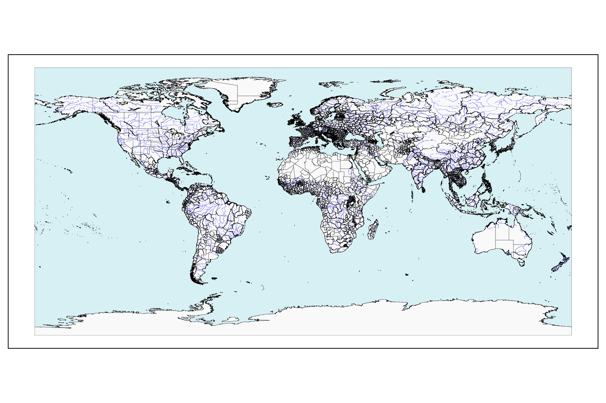
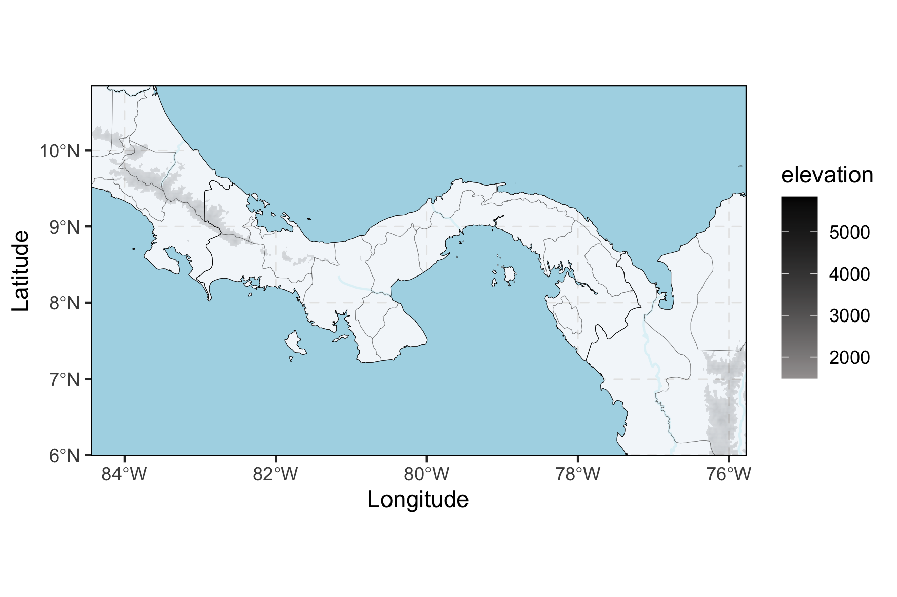
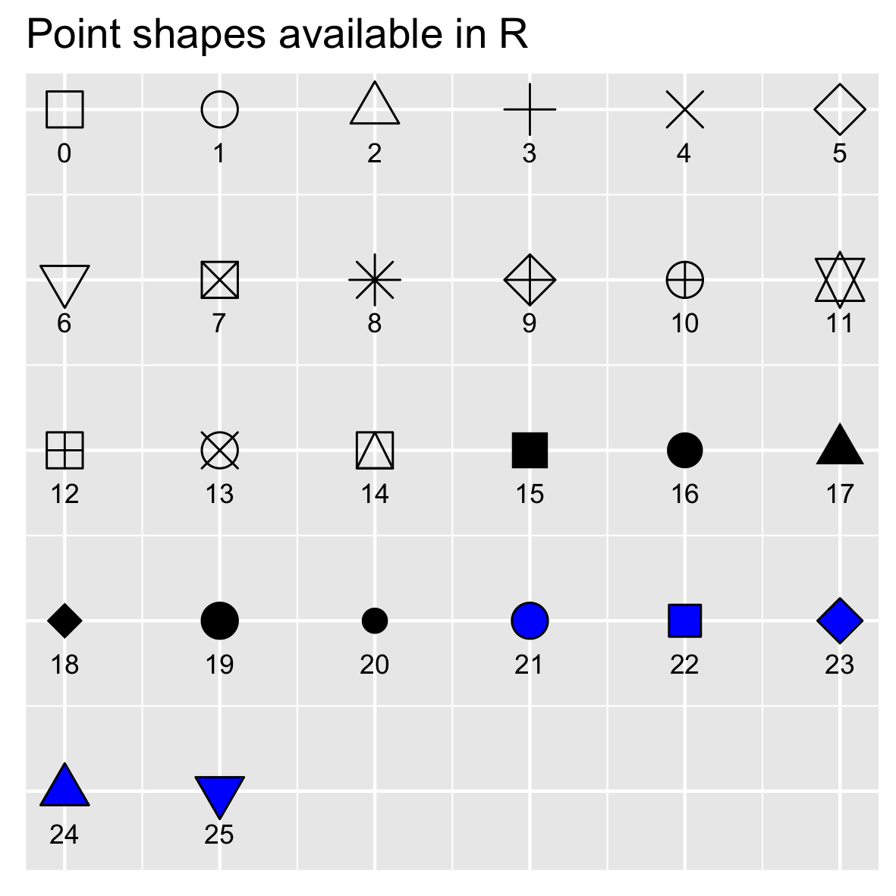
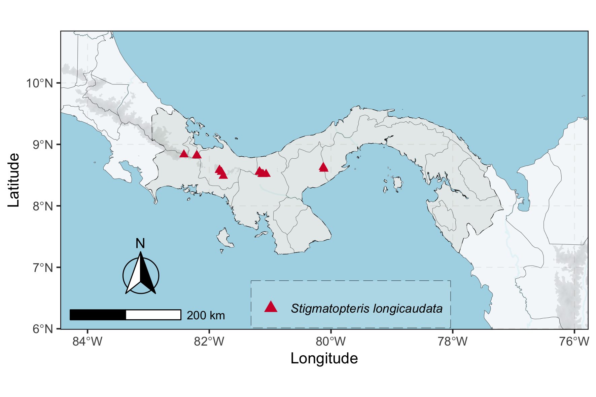
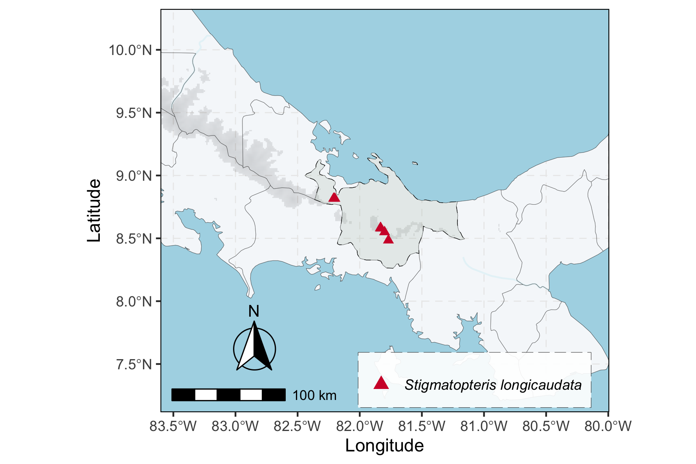
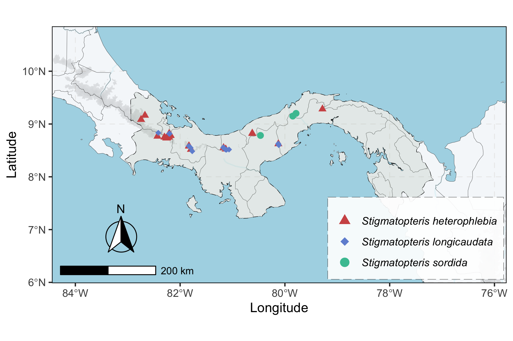

Species Occurrence Maps
================
Weston Testo
11/25/2021

In this walkthrough, I show an easy and reproducible way to make species
occurrence maps in R. There are lots of ways to do this seemingly simple
task, but I can speak from experience that it is one thing to make a map
with dots, and a very different thing to make visually appealing maps
consistently. We’ve all seen papers where maps are at different scales,
legends overlap important parts of the map, or there are so many layers
of data that finding the occurrence points is a little bit scrolling
through a [GeoCities website](https://www.cameronsworld.net/). I’m not
trying to pick on anyone, either - I’d love to have re-do’s of a few
papers I have published so I could have a new go at the maps\!

Obviously, map design comes down in part to personal preference and
specific needs, but I think there are some principles that are broadly
applicable.

**Here are a few things that are important to me:**

  - Consistent spatial scale across maps
  - Non-cluttered layout (no ugly legends covering 1/3 of the map)
  - Easily customizable (symbology, location, color scheme)
  - Inclusion of physical features (rivers, topography, etc.)
  - Publication quality (without post-R modification)

-----

## Why make occurrence maps this way?

  - **Scaleability**
      - This code should work for taxa from anywhere on Earth, at most
        scales.
  - **Flexibility**
      - You can easily control the layout of the map, from symbols to
        legend placement.
      - Get the right map the first time – no need to open Illustrator\!
  - **Elevation, made easy**
      - Uses the **elevatr** package’s API functionality to provide
        elevation data.
      - Allows you to use data just for the extent of your map, avoiding
        big rasters.
      - Only care about alpine zones? No problem – adjust threshold
        easily.
  - **Consistency**
      - Found a new record? Workflow allows for maps to be updated
        easily.

-----

# Step-by-step walkthrough

In this walkthrough, we’ll plot occurrence data for the fern genus
*Stigmatopteris* for Panamá that have been downloaded from the
Pteridophyte Collections Consortium’s [data
portal](https://www.pteridoportal.org/portal/index.php).

We’ll start off by mapping all occurrences of a single species,
*Stigmatopteris longicaudata*, in Panamá. Then, we’ll focus on the
records of that species in the Ngäbe-Buglé *comarca indígena*. Finally,
we’ll zoom back out to the entire country and map the occurrences of
three different species.

For the purposes of keeping things clear and accessible to users with
varying familiarity with R, I have not wrapped anything into functions
for this walkthough. But, this can pretty easily be done if you want to
condense things a bit. As we’ll see, the structure of this code also
works nicely with loops or (preferably) the `purrr` package if you want
to automate this process for a group of taxa.

# Part 1: Single species, whole country occurrence map

### Loading & checking occurrence data

First, we’ll want to load the packages we’ll be using:

``` r
library(raster) #for processing some spatial data
library(rnaturalearth) #for downloading shapefiles
library(sf) #for processing shapefiles
library(elevatr) #for downloading elevation data
library(dplyr) #to keep things tidy
library(magrittr) #to keep things very tidy
library(ggspatial) #for scale bars and arrows
library(ggplot2) #for tidy plotting
library(ggpubr) #for easy selection of symbols
library(colourpicker) #for easy selection of colors
```

-----

**Note:** I’ve noticed that some users of R version 4.x.x. run into
problems with **rnaturalearth**, specifically that some commands will
not work and errors related to the **rnaturalearthhires** package.
Unfortunately, as of the time of writing, installing
**rnaturalearthhires** on R version 4+ is problematic, and installing
either the CRAN or development versions by the usual means does not
work. **If you are having problems with this**, you can solve this by
doing the following: `install.packages("remotes")` followed by
`remotes::install_github("ropenscilabs/rnaturalearthhires")` and then
`library("rnaturalearthhires")`.

-----

Now we’ll load the CSV with our occurrence data. The lat/long data are
in decimal degrees (WGS84). The order of columns is important here:
taxon, latitude, longitude.

``` r
points <- read.csv("stigmatopterisPM.csv")

head(points)
```

    ##                 scientificName decimalLatitude decimalLongitude
    ## 1   Stigmatopteris alloeoptera         8.53166        -81.14583
    ## 2     Stigmatopteris contracta         8.81666        -82.41666
    ## 3     Stigmatopteris contracta         8.76666        -82.43333
    ## 4     Stigmatopteris contracta         9.06611        -82.73222
    ## 5    Stigmatopteris guianensis         9.25000        -78.83333
    ## 6 Stigmatopteris heterophlebia         8.75000        -82.30000

Now that we have our occurrence data loaded, let’s pick the taxon that
we want generate the map for.

``` r
speciesList <- levels(points$scientificName)

print(speciesList)
```

    ## [1] "Stigmatopteris alloeoptera"   "Stigmatopteris contracta"    
    ## [3] "Stigmatopteris guianensis"    "Stigmatopteris heterophlebia"
    ## [5] "Stigmatopteris killipiana"    "Stigmatopteris lechleri"     
    ## [7] "Stigmatopteris longicaudata"  "Stigmatopteris michaelis"    
    ## [9] "Stigmatopteris sordida"

Cool - there are nine species of *Stigmatopteris* in Panamá, including
the species that we want to make a map for: *Stigmatopteris
longicaudata*. Let’s filter it out.

``` r
taxon <- "Stigmatopteris longicaudata" #specify taxon name here

pointsFiltered <- points %>% filter(scientificName == taxon) %>% droplevels()

unique(pointsFiltered$scientificName)
```

    ## [1] Stigmatopteris longicaudata
    ## Levels: Stigmatopteris longicaudata

Great – we can see now that we only have 16 records and all of them are
*Stigmatopteris longicaudata*.

Since we’ll be working with the`sf` package, we’ll convert our data to a
Simple Features object.

``` r
pointsFiltered <- st_as_sf(pointsFiltered,coords = c(3,2), 
        crs= '+proj=longlat +datum=WGS84 +no_defs +ellps=WGS84+towgs84=0,0,0')
```

### Loading shapefiles

Now, let’s download the shapefiles that we will be using as the basis of
our map. You will notice that we load both country-level and
state/province level shapefiles. This gives us more flexibility later
when we want to select our focal areas for our map; if you don’t want
state-level divisions to be drawn, you can simply comment out a line of
code when it comes to plotting.

``` r
map <- ne_countries(scale = 10, returnclass = "sf")

states <- ne_states(returnclass = "sf")

ocean <- ne_download(scale = 10, type = 'ocean', 
                   category = 'physical', returnclass = 'sf')

rivers <- ne_download(scale = 10, type = 'rivers_lake_centerlines', 
                    category = 'physical', returnclass = 'sf')
```

We can take a quick peek to make sure everything is there…

Pretty basic, but it’s a start.

We’ll want to add some information about topography to make things a bit
more interesting and visually appealing, but accessing a global-scale
raster file with elevation data is not ideal. So, our next step is to
define the extent of our map. Once we have that done, we can access just
the elevation data that we need to cover the map.

The approach we’ll use to define the extent of our map is to identify
our area of interest. In this case, we’ll want to select Panamá.

``` r
focalArea <- map %>% filter(admin == "Panama")
```

-----

**Note:** If you wanted to frame your map around multiple countries, it
is easy but just requires slightly different grammar: `map %>%
filter(admin %in% c("Mexico", "Cuba"))`. Other countries within the
extent bounded by these countries will still appear, but you will have
the option to alter the appearance of the focal countries, as we will
see later. We can also use the same `%in%` operator and the `c("a",
"b")` vector notation to select multiple state/provinces or species.

-----

**Another note:** If you wanted to frame your map around the extent of
your occurrence points rather than a given political unit, you could
simply set your occurrence data to be **focalArea**: `focalArea <-
pointsFiltered`.

-----

### Defining the map extent

We can now use `st_buffer()` and `st_bbox()` from the **sf** package to
define the extent of our map (we’ll call this **limit**) as well as the
extent of the elevation data that we will download (we’ll call this
**clipLimit**). **limit** will be defined by a 1° buffer around the
extent of Panamá, and **clipLimit** will be 2°, just to be safe. We’ll
also make a new SpatialPolygons object from **clipLimit** that will be
called **limitExtent** – we just need this to process the elevation
data.

-----

**Note:** You may get a warning here about buffering latitude/longitude
data; don’t worry about it.

-----

``` r
limit <- st_buffer(focalArea, dist = 1) %>% st_bbox()

clipLimit <- st_buffer(focalArea, dist = 2) %>% st_bbox()

limitExtent <- as(extent(clipLimit), 'SpatialPolygons')

crs(limitExtent) <- "+proj=longlat +datum=WGS84 +no_defs"
```

For the fun of it, we can take a look at how this all works. The extent
of the area where we will download elevational data is bounded by the
dashed line, the solid line shows the extent of our map, and we can see
Panamá in the center.


### Obtaining elevation data

There are lots of ways to include elevation information in maps like
these: contours, hillshades, including shape and aspect, etc. Here,
we’ll keep things simple, and just include a subtle grayscale gradient
depicting mountainous areas - in this case, above 1500 m. I think it
looks nice, and conveys important information without cluttering the map
and obscuring the most important point: where the species occur.

Regardless of how you choose to visualize elevation on a map, the
fundamental problem is dealing with the underlying data. Digital
elevation models (DEM) are generally available as TIFFs, and as with
other raster data, high-resolution DEM files take up a lot of space and
are not particularly easy to process in R.

If you are just making maps from a single small region, it is relatively
straightforward to download a few DEM tiles, stitch them together, and
use that locally. Of course, this quickly becomes burdensome if you
start to make maps from different regions. Here, we’re going to get
around this challenge by using the `get_elev_raster` function from the
**elevatr** package, which downloads DEM files for a specified region.
It is fast and flexible, which makes it a great fit for this
application, and since we have already explicitly defined the extent of
our map, we can use it easily.

Here, we’ll download the DEM tile for our area of interest, convert the
TIFF to a three-column data frame for ease of **ggplot2** plotting, and
delete all elevations below our specified threshold of 1500 m.

``` r
elev<-get_elev_raster(locations = limitExtent, z = 6, override_size_check = T)

elevDF<-as.data.frame(elev, xy=TRUE)

colnames(elevDF)<-c("x", "y", "elevation")

elevDF[, 3][elevDF[, 3] < 1500] <- NA
```


This looks right – we can see the Cordillera de Talamanca in the western
part of the country, along with some other scattered peaks. The color
scheme is clear but light enough so that things are visible.

### Specifying symbol details and legend position

Now that we have all of the layers of our map loaded, we are almost
ready to visualize our map. Before we do that, we need to set a few of
the important parameters: 1) the symbol and color used to mark
occurrences, and 2) the position of our legend within the map.

Point shapes are specified in R by the `pch` (**p**oint **ch**aracter)
argument, which are coded numerically, with values from 1 to 25. If you
are like me, you probably can’t remember which number corresponds to
which shape – no worries, we can use the `show_point_shapes()` from the
**ggpubr** package to help us out:

``` r
ggpubr::show_point_shapes()
```



It is pretty clear that these are all just variations on the same few
themes, and it might not be clear what the difference is between, say,
**pch = 15** and **pch = 22**. If you need clarification on this, check
out this [blog
post](https://www.datanovia.com/en/blog/pch-in-r-best-tips/). We’ll pick
pch = 17 for our map.

While we’re at it, we can also specify the color that we want to use for
the symbol. I prefer to use hex codes for this purpose, as it provides a
bit more freedom. The one downside of using hex codes is that
**\#E61D19** is a little harder to remember than **“red”**. You can find
hex codes online, but an easier option is to use the **colourpicker**
package, which (amongst other things) provides an interactive color
picker widget.  
When this widget appears, click on the box below “Select any colour”,
choose your color, and click “Done”. Your color choice will be
automatically populated. Here, we chose a red, which just happens to
appear on Panamá’s flag: \#D21034.

``` r
pch <- 17

fillColor <- colourPicker(numCols = 1)
```

The last thing that we need to do is specify the position of our symbol
legend, which will show the nice blue triangle we have specified, along
with the name of the taxon shown in the map. I prefer to place this
inside the map when possible, and I’ll draw a small box around it and
provide a partially transparent background so it is visible and isn’t
confused with an actual occurrence point. The latter details are
specified in the plotting code block itself, but because we may want to
adjust the position based on details of a given map, I’ll specify the
position here.

-----

**Note:** depending on the details of your RStudio interface, the
dimensions of the map and the position of the legend may vary slightly
between the ‘Plots’ pane and the saved plot. So, don’t necessarily trust
the appearance in the ‘Plots’ pane – check out the exported version
first. It is common to have to move the legend around a few times to get
it right.

-----

We’ll be specifying the position of the legend within the map using
**ggplot2’s** `legend.position()` argument. This relies on an *xy*
coordinate system, so keep in mind:

  - **c(0, 0) = bottom-left**  
  - **c(0, 1) = top-left**  
  - **c(1, 0) = bottom-right**  
  - **c(1, 1) = top-right**

Given what we’ve seen so far from the layout of the map, I will choose a
position near the bottom towards the middle, which should place the
legend in the Pacific Ocean, far away from any *Stigmatopteris*. I avoid
picking the bottom-left here, as we will place our directional arrow and
scale bar in the bottom-left corner.

``` r
position <- c(0.55, 0.085)
```

### Making the map\!

Now that we have specified the most important parameters for the map,
let’s put it all together\!

``` r
occMap <-
  ggplot() +
  geom_tile(data = elevDF, aes(x=x, y=y, fill=elevation), alpha =0.4)+
  scale_fill_gradient(low="#a3a0a0", high= "#000000", 
                      na.value="transparent")+
  geom_sf(data = ocean, color = "black", size = 0.05, fill = "#add8e6")+
  geom_sf(data = rivers, color = "#d7f2fa", size = 0.5)+
  geom_sf(data = states, color = "black", size = 0.05, fill = "#f5f5f5", alpha = 0.5)+
  geom_sf(data = focalArea, color = "black", size = 0.15,
          linetype = "dashed", fill = "#acbdac", alpha = 0.2)+
  geom_sf(data = pointsFiltered, aes(geometry = geometry,
                                     shape = scientificName,
                                     color = scientificName), size = 2)+
  scale_shape_manual(values = pch)+
  scale_color_manual(values = fillColor)+
  coord_sf(
    xlim = c(limit["xmin"], limit["xmax"]),
    ylim = c(limit["ymin"], limit["ymax"])) +
  labs(x="Longitude", y="Latitude", color = taxon)+
  annotation_scale(location = "bl", width_hint = 0.3) +
  annotation_north_arrow(location = "bl", which_north = "true", 
                         pad_x = unit(0.5, "in"), pad_y = unit(0.3, "in"),
                         style = north_arrow_fancy_orienteering) +
  guides(colour = guide_legend(override.aes = list(size = 3)))+
  theme(legend.position = position,
        legend.key = element_blank(),
        legend.title = element_blank(),
        legend.background=element_blank(),
        legend.text = element_text(face = "italic"),
        legend.box.margin = margin(0, 0, 0, 0),
        legend.box.background = element_rect(color = "black", size = 0.1,
                                             linetype = "longdash", 
                                             fill = alpha("white", 0.15)))+
  theme(panel.grid.major = element_line(colour = "#c9c9c9", 
                                        linetype = "dashed", 
                                        size = 0.3), 
        panel.background = element_rect(fill = "#f0f8ff"), 
        panel.border = element_rect(fill = NA))+
        guides(fill=FALSE)+
        guides(shape=FALSE)+
        guides(color=guide_legend(override.aes = list(shape = pch, 
                                                      fill=fillColor, size =3)))

occMap
```



Great – everything looks like it has come out in the right spot.

-----

**Note:** if you want to edit something in the map other than the items
we have already set, you can modify some of the following:

**-If you want to change the color of the ocean** -Modify the `fill`
argument on the line that starts `geom_sf(data = ocean`

**-If you want to change the color of Panamá** -Modify the `fill`
argument on the line that starts `geom_sf(data = focalArea`

**-If you want to change the position or size of the scale bar** -Adjust
the arguments for the `annotation_scale` function

**-If you want to change the position or type of the arrow** -Adjust the
arguments for the `annotation_north_arrow` function

**-If you want to change the color/shading of the mountainous areas**
-Adjust the arguments for the `scale_fill_gradient` function

**-If you want to change the details (color, bounding box) of the
legend** -Modify the arguments for the `legend.box.background` function

-----

### Saving our plot

Now that we have a nice looking plot, let’s save it. To keep things in
order, we’ll create a subdirectory within our working directory named
**plots**, and then create a directory within that with the name of the
taxon in our map. We’ll also use the taxon name as the title for the
plots that we’ll save. We’ll save a version as a PDF and as a TIFF, and
we can adjust dimensions based on guidelines of the journal we are going
to publish in.

The nice part of this approach to saving the plots is that new
directories and filenames will be created automatically the next time
you make a map for a different taxon. This will allow you to keep track
of everything and avoid confusing naming conventions.

``` r
dir.create("plots")
nameSave<-get("taxon") %>% sub("\\s","_",.)

saveDirectory<-paste("plots/",nameSave,sep="")

dir.create(saveDirectory)

fileNameTiff<-paste(nameSave,".tiff",sep="")

fileNamePDF<-paste(nameSave,".PDF",sep="")
```

Now we can go ahead and save the plots. Note that the `ggsave` function
will save the last item open in the **Plots** panel, so it is important
that we run `dev.off()` when we are done to clean the slate.

``` r
ggsave(filename = fileNameTiff, path = saveDirectory, width = 15, height = 15, 
       units = "cm", device = 'tiff', dpi=300)

ggsave(filename = fileNamePDF, path = saveDirectory, width = 15, height = 15, 
       units = "cm", device = 'pdf', dpi=300)

dev.off()
```

    ## null device 
    ##           1

That’s it\! You can go check your newly saved plots and marvel at the
distribution of *Stigmatopteris longicaudata*\!

Now let’s move onto some new mapping scenarios.

-----

-----

# Part 2: Species occurrence maps for a single state

Now that we have made a map of occurrences of *Stigmatopteris
longicaudata* from Panamá, let’s take the opportunity to zoom in a bit
and look at collections from just a single part of the country. We’ll
look at records from the Ngäbe-Buglé *comarca indígena*, in the
northwestern part of the country.

### Checklist for mapping a single state

If you want to generate a map of records from a single state-level
region and focus the map on that region (rather than the whole country),
we’ll need to adjust a few steps in the workflow that we used before.
For the sake of space, we’ll just focus on the differences here, but it
is best practice to run the code from the top, in order to avoid
specifying something incorrectly.

#### **Things to change**

\-Change the `focalArea` from Panamá to Ngäbe-Buglé  
\-Filter the occurrence records to only retain those in Ngäbe-Buglé  
\-Change the extent of our map

### Changing the focal area specification

Unsurprisingly, this works much like we did before, but we’ll be using
the *states* object rather than *map*. To make sure we get the spelling
right, let’s quickly check the names of all the state-level
administrative units in Panamá:

``` r
stateList <- states %>% filter(admin == "Panama")
print(stateList$name)
```

    ##  [1] "Bocas del Toro" "Chiriquí"       "Kuna Yala"      "Emberá"        
    ##  [5] "Darién"         "Panama"         "Coclé"          "Veraguas"      
    ##  [9] "Colón"          "Ngöbe Buglé"    "Los Santos"     "Herrera"

Good thing we did that – they use an “ö” rather than an “ä” in the
shapefile metadata. Now we can filter out the right focal area:

``` r
focalState <- states %>% filter(name == "Ngöbe Buglé")
```

### Filtering records to state-level

Now that we have this shapefile, we can filter our **pointsFiltered**
object to only retain those in Ngöbe Buglé using `st_join()` from the
**sf** package.

``` r
pointsFilteredState <- st_join(pointsFiltered, focalState, 
                               join = st_intersects) %>% 
                               filter(!is.na(name)) %>% 
                               select(scientificName, geometry)
```

We can see we are now down to a total of seven records, which looks
right.

### Adjust map extent

Now that we have redefined our focal area, we can use it to set the
extent of our map. As above, I’m changing object names here to keep
track of things. If I were starting from scratch, I would need to use
`limitExtentState` to define the DEM data to download with **elevatr**,
but since we already have those data, I’ll skip that step here.

``` r
limitState <- st_buffer(focalState, dist = 1) %>% st_bbox()

clipLimitState <- st_buffer(focalState, dist = 2) %>% st_bbox()

limitExtentState <- as(extent(clipLimitState), 'SpatialPolygons')

crs(limitExtentState) <- "+proj=longlat +datum=WGS84 +no_defs"
```

### Plot map of Stigmatopteris longicaudata in Ngöbe Buglé

With these new inputs, we are ready to plot our new map, with only
slightly modified **ggplot2** code. We’ll change the position of the
legend a bit for this one, as we are zoomed in a bit more.

``` r
position <- c(0.70, 0.08)

occStateMap <-
  ggplot() +
  geom_tile(data = elevDF, aes(x=x, y=y, fill=elevation), alpha =0.4)+
  scale_fill_gradient(low="#a3a0a0", high= "#000000", 
                      na.value="transparent")+
  geom_sf(data = ocean, color = "black", size = 0.05, fill = "#add8e6")+
  geom_sf(data = rivers, color = "#d7f2fa", size = 0.5)+
  geom_sf(data = states, color = "black", size = 0.05, fill = "#f5f5f5", alpha = 0.5)+
  geom_sf(data = focalState, color = "black", size = 0.15,
          linetype = "dashed", fill = "#acbdac", alpha = 0.2)+
  geom_sf(data = pointsFilteredState, aes(geometry = geometry,
                                     shape = scientificName,
                                     color = scientificName), size = 2)+
  scale_shape_manual(values = pch)+
  scale_color_manual(values = fillColor)+
  coord_sf(
    xlim = c(limitState["xmin"], limitState["xmax"]),
    ylim = c(limitState["ymin"], limitState["ymax"])) +
  labs(x="Longitude", y="Latitude", color = taxon)+
  annotation_scale(location = "bl", width_hint = 0.3) +
  annotation_north_arrow(location = "bl", which_north = "true", 
                         pad_x = unit(0.5, "in"), pad_y = unit(0.3, "in"),
                         style = north_arrow_fancy_orienteering) +
  guides(colour = guide_legend(override.aes = list(size = 3)))+
  theme(legend.position = position,
        legend.key = element_blank(),
        legend.title = element_blank(),
        legend.background=element_blank(),
        legend.text = element_text(face = "italic"),
        legend.box.margin = margin(0, 0, 0, 0),
        legend.box.background = element_rect(color = "black", size = 0.1,
                                             linetype = "longdash", 
                                             fill = alpha("white", 0.9)))+
  theme(panel.grid.major = element_line(colour = "#c9c9c9", 
                                        linetype = "dashed", 
                                        size = 0.3), 
        panel.background = element_rect(fill = "#f0f8ff"), 
        panel.border = element_rect(fill = NA))+
        guides(fill=FALSE)+
        guides(shape=FALSE)+
        guides(color=guide_legend(override.aes = list(shape = pch, 
                                                      fill=fillColor, size =3)))

occStateMap
```



Again, remember that the **Plots** panel is a bit misleading, but if you
save the output, it should look like the above image. Now let’s try the
last type of map we’ll cover here: a multi-species occurrence map.

# Part 3: Species occurrence maps for multiple species

Now that we have made a map of occurrences of *Stigmatopteris
longicaudata* from Ngäbe-Buglé, let’s zoom back out and make another
plot of the whole country. But this time, we’ll include information from
not one, but three species of *Stigmatopteris*. As we’ll see, this
involves a few other modifications to the workflow.

### Checklist for mapping multiple taxa

In this case, we will be able to use the exact same approach to defining
the focal area and the extent of the map as in Part 1. What we’ll have
to change is simply how we filter the occurrence data, along with
changing how we specify symbols for plotting. We’ll also have to make
some minor adjustments to how we format file and directory names for
saving the plots at the end.

#### **Things to change**

\-Filter multiple species records, instead of one  
\-Specify multiple symbols and multiple colors  
\-Modify our saving preferences

### Filtering occurrence records for multiple taxa

Previously, we were just working with occurrence records of a single
species, *Stigmatopteris longicaudata*. Now, we are going to map records
of three species: *Stigmatopteris longicaudata*, *Stigmatopteris
sordida*, and *Stigmatopteris heterophlebia*. As I pointed out before,
the `==` notation we used previously won’t work to filter multiple
records. Instead, we need to do the following:

``` r
taxa<-c("Stigmatopteris longicaudata", "Stigmatopteris sordida", "Stigmatopteris heterophlebia") 

pointsFilteredMulti<-points %>% filter(scientificName %in% taxa) %>% droplevels()

unique(pointsFilteredMulti$scientificName)
```

    ## [1] Stigmatopteris heterophlebia Stigmatopteris longicaudata 
    ## [3] Stigmatopteris sordida      
    ## 3 Levels: Stigmatopteris heterophlebia ... Stigmatopteris sordida

We now have a total of 43 records of these three species – great\! Now
let’s pick shapes and colors for the symbols.

Again, we’ll want to convert this to an **sf** object.

``` r
pointsFilteredMulti <- st_as_sf(pointsFilteredMulti,coords = c(3,2), 
        crs= '+proj=longlat +datum=WGS84 +no_defs +ellps=WGS84+towgs84=0,0,0')
```

### Specifying symbol details for multiple species

This works just as before, except we are specifying three symbols and
colors here. For the colourPicker widget, you’ll need to click on each
of the three numbered boxes that appear and select a color for each.
Obviously, you’ll want to change these according to the number of the
taxa you want to map.

-----

**Note:** Please keep in mind that many people have a difficult time
visualizing various color combinations. This tends to matter more for
other visualization situations (e.g., color ramps), and the choice of
different symbols helps a lot, but it is important to keep this in mind.
For more information, take a look at [Fabio Crameri’s
website](https://www.fabiocrameri.ch/colourmaps/) and Thomas Lin
Pedersen’s [R package](https://github.com/thomasp85/scico) that uses his
color ramps.

-----

``` r
pchs <- c(17,18,19)

fillColors<-colourPicker(numCols = 3)
```

Now that we have these, we can plot the occurrences of these species,
using basically the same code that we used in Part 1. We’ll change the
position of the legend some more, and decrease its transparency by
increasing the `alpha` value for the `legend.box.background()` argument.

``` r
position <- c(0.8, 0.175)


occMapMulti <-
  ggplot() +
  geom_tile(data = elevDF, aes(x=x, y=y, fill=elevation), alpha =0.4)+
  scale_fill_gradient(low="#a3a0a0", high= "#000000", 
                      na.value="transparent")+
  geom_sf(data = ocean, color = "black", size = 0.05, fill = "#add8e6")+
  geom_sf(data = rivers, color = "#d7f2fa", size = 0.5)+
  geom_sf(data = states, color = "black", size = 0.05, fill = "#f5f5f5", alpha = 0.5)+
  geom_sf(data = focalArea, color = "black", size = 0.15,
          linetype = "dashed", fill = "#acbdac", alpha = 0.2)+
  geom_sf(data = pointsFilteredMulti, aes(geometry = geometry,
                                     shape = scientificName,
                                     color = scientificName), size = 2)+
  scale_shape_manual(values = pchs)+
  scale_color_manual(values = fillColors)+
  coord_sf(
    xlim = c(limit["xmin"], limit["xmax"]),
    ylim = c(limit["ymin"], limit["ymax"])) +
  labs(x="Longitude", y="Latitude", color = taxon)+
  annotation_scale(location = "bl", width_hint = 0.3) +
  annotation_north_arrow(location = "bl", which_north = "true", 
                         pad_x = unit(0.5, "in"), pad_y = unit(0.3, "in"),
                         style = north_arrow_fancy_orienteering) +
  guides(colour = guide_legend(override.aes = list(size = 3)))+
  theme(legend.position = position,
        legend.key = element_blank(),
        legend.title = element_blank(),
        legend.background=element_blank(),
        legend.text = element_text(face = "italic"),
        legend.box.margin = margin(0, 0, 0, 0),
        legend.box.background = element_rect(color = "black", size = 0.1,
                                             linetype = "longdash", 
                                             fill = alpha("white", 0.9)))+
  theme(panel.grid.major = element_line(colour = "#c9c9c9", 
                                        linetype = "dashed", 
                                        size = 0.3), 
        panel.background = element_rect(fill = "#f0f8ff"), 
        panel.border = element_rect(fill = NA))+
        guides(fill=FALSE)+
        guides(shape=FALSE)+
        guides(color=guide_legend(override.aes = list(shape = pchs, 
                                                      fill=fillColors, size =3)))

occMapMulti
```



That’s it\! I hope this will help you make visually appealing,
informative, and consistent species occurrence maps – if you have any
comments or questions, let me know\!
